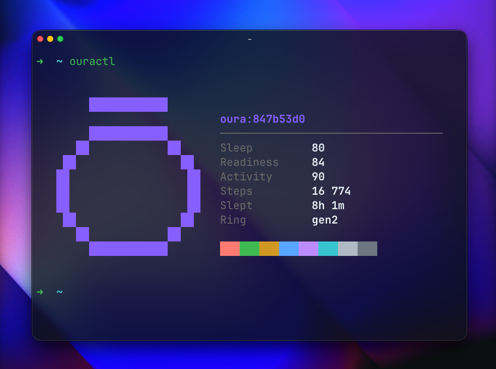

<p align="center">
  
  <p align="center">A command line tool for your Oura Ring data</p>
</p>

<hr>

<p align="center">
<a href="https://github.com/hagelstam/ouractl/releases/latest"></a>
<a href="/LICENSE"></a>
<a href="https://github.com/hagelstam/ouractl/actions/workflows/build.yml"></a>
</a>
<a href="https://goreportcard.com/report/github.com/hagelstam/ouractl"></a>
</p>

## Screenshot



## Install

### Go

```bash
go install github.com/hagelstam/ouractl@latest
```

### macOS

```bash
brew tap hagelstam/tap
brew install ouractl
```

### Manual

Download a binary compatible with your system from the [releases tab](https://github.com/hagelstam/ouractl/releases) and install it manually.

## Features

- **Summary**: Neofetch style summary of latest scores, steps and sleep duration
- **Sleep**: browse daily sleep scores, durations, and vitals
- **Activity**: browse daily steps, calories, distance and activity time breakdowns
- **Readiness**: browse daily recovery scores, temperature trends and contributor details
- **Ring**: hardware info, firmware version and setup date
- **Auth**: token-based login and status check

## Usage

Run `ouractl --help` for the full list of commands and flags.

> [!TIP]
> Generate a token at [cloud.ouraring.com/personal-access-tokens](https://cloud.ouraring.com/personal-access-tokens).

## Development

### Prerequisites

- [Go](https://go.dev/)
- [Task](https://taskfile.dev/)

### Running locally

```bash
task          # run the CLI
task -- sleep # run CLI with a subcommand (e.g. sleep)
task debug    # run the CLI with debug logging
task logs     # tail the debug logs
```

## Under the hood

- [cobra](https://github.com/spf13/cobra) for the CLI
- [bubbletea](https://github.com/charmbracelet/bubbletea) for the TUI
- [lipgloss](https://github.com/charmbracelet/lipgloss) for the styling

## License

This project is licensed under the terms of the [MIT](https://choosealicense.com/licenses/mit/) license.
